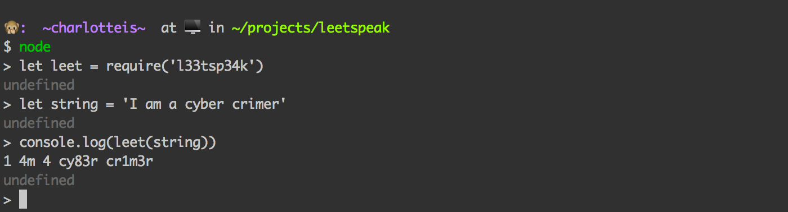

# l33tsp34k

:computer: Converts text to l33tsp34k

   

[](https://david-dm.org/charlotteis/l33tsp34k) [](https://david-dm.org/charlotteis/l33tsp34k#info=devDependencies) [](https://github.com/feross/standard)



## Installation

`npm install l33tsp34k`

## Usage

```javascript
var leet = require('l33tsp34k')
var string = leet("I am a cyber crimer")
console.log(string)

// => 'I 4m 4 cyb3r cr1m3r'
```

[Play with this in the browser yourself!](https://tonicdev.com/var/l33tsp34k)

## Code of Conduct

We use the Contributor Convenant, which you can see [here](CODEOFCONDUCT.md).

## Contributing

See our [contributing guide](CONTRIBUTING.md).
